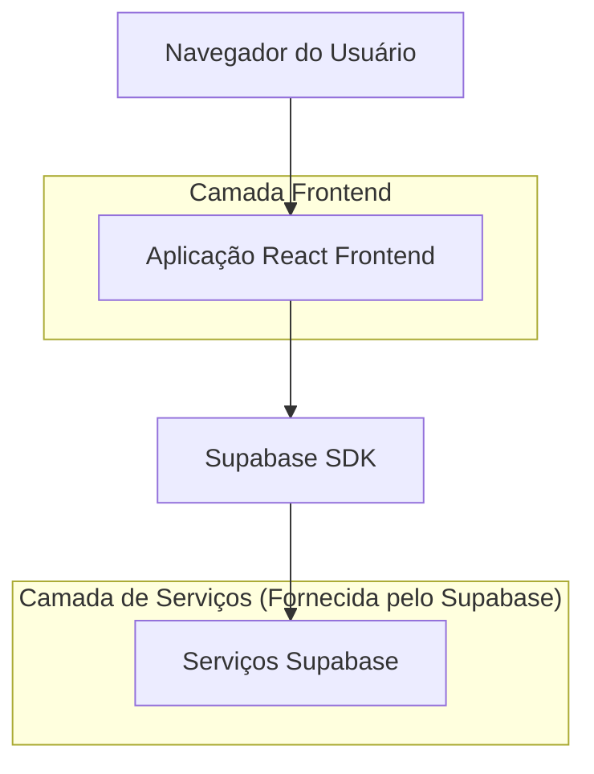
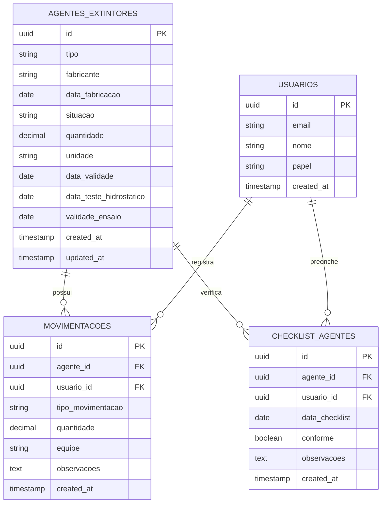

# Arquitetura Técnica - Sistema de Agentes Extintores

## 1. Design da Arquitetura



## 2. Descrição das Tecnologias

* Frontend: React\@18 + TypeScript + TailwindCSS\@3 + Vite

* Backend: Supabase (PostgreSQL + Auth + Storage)

* UI Components: shadcn/ui + Lucide React

* Charts: Recharts para gráficos de dashboard

## 3. Definições de Rotas

| Rota                             | Propósito                                           |
| -------------------------------- | --------------------------------------------------- |
| /agentes-extintores              | Página principal com dashboard e navegação por abas |
| /agentes-extintores/estoque      | Gestão de estoque de agentes                        |
| /agentes-extintores/checklist    | Checklist mensal de verificação                     |
| /agentes-extintores/movimentacao | Registro de movimentações                           |
| /agentes-extintores/relatorios   | Geração de relatórios                               |

## 4. Definições de API

### 4.1 APIs Principais

**Gestão de Agentes Extintores**

```
GET /api/agentes-extintores
```

Request:

| Nome do Parâmetro | Tipo do Parâmetro | Obrigatório | Descrição                                       |
| ----------------- | ----------------- | ----------- | ----------------------------------------------- |
| tipo              | string            | false       | Filtrar por tipo (LGE, PO\_QUIMICO, NITROGENIO) |
| situacao          | string            | false       | Filtrar por situação (EM\_LINHA, ESTOQUE)       |

Response:

| Nome do Parâmetro | Tipo do Parâmetro | Descrição             |
| ----------------- | ----------------- | --------------------- |
| id                | uuid              | ID único do agente    |
| tipo              | string            | Tipo do agente        |
| fabricante        | string            | Fabricante do agente  |
| data\_fabricacao  | date              | Data de fabricação    |
| situacao          | string            | Situação atual        |
| quantidade        | number            | Quantidade disponível |
| unidade           | string            | Unidade de medida     |

Exemplo:

```json
{
  "id": "123e4567-e89b-12d3-a456-426614174000",
  "tipo": "LGE",
  "fabricante": "Fabricante ABC",
  "data_fabricacao": "2024-01-15",
  "situacao": "ESTOQUE",
  "quantidade": 500,
  "unidade": "litros"
}
```

**Registro de Movimentações**

```
POST /api/movimentacoes
```

Request:

| Nome do Parâmetro  | Tipo do Parâmetro | Obrigatório | Descrição                                        |
| ------------------ | ----------------- | ----------- | ------------------------------------------------ |
| agente\_id         | uuid              | true        | ID do agente                                     |
| tipo\_movimentacao | string            | true        | ENTRADA ou SAIDA                                 |
| quantidade         | number            | true        | Quantidade movimentada                           |
| equipe             | string            | false       | Equipe responsável (Alfa, Bravo, Charlie, Delta) |
| observacoes        | string            | false       | Observações da movimentação                      |

Response:

| Nome do Parâmetro | Tipo do Parâmetro | Descrição                 |
| ----------------- | ----------------- | ------------------------- |
| success           | boolean           | Status da operação        |
| movimentacao\_id  | uuid              | ID da movimentação criada |

## 5. Modelo de Dados

### 5.1 Definição do Modelo de Dados



### 5.2 Linguagem de Definição de Dados

**Tabela de Agentes Extintores (agentes\_extintores)**

```sql
-- Criar tabela
CREATE TABLE agentes_extintores (
    id UUID PRIMARY KEY DEFAULT gen_random_uuid(),
    tipo VARCHAR(20) NOT NULL CHECK (tipo IN ('LGE', 'PO_QUIMICO', 'NITROGENIO')),
    fabricante VARCHAR(255) NOT NULL,
    data_fabricacao DATE NOT NULL,
    situacao VARCHAR(20) NOT NULL CHECK (situacao IN ('EM_LINHA', 'ESTOQUE')),
    quantidade DECIMAL(10,2) NOT NULL DEFAULT 0,
    unidade VARCHAR(20) NOT NULL,
    data_validade DATE,
    data_teste_hidrostatico DATE,
    validade_ensaio DATE,
    created_at TIMESTAMP WITH TIME ZONE DEFAULT NOW(),
    updated_at TIMESTAMP WITH TIME ZONE DEFAULT NOW()
);

-- Criar índices
CREATE INDEX idx_agentes_extintores_tipo ON agentes_extintores(tipo);
CREATE INDEX idx_agentes_extintores_situacao ON agentes_extintores(situacao);
CREATE INDEX idx_agentes_extintores_data_validade ON agentes_extintores(data_validade);

-- Permissões Supabase
GRANT SELECT ON agentes_extintores TO anon;
GRANT ALL PRIVILEGES ON agentes_extintores TO authenticated;
```

**Tabela de Movimentações (movimentacoes)**

```sql
-- Criar tabela
CREATE TABLE movimentacoes (
    id UUID PRIMARY KEY DEFAULT gen_random_uuid(),
    agente_id UUID NOT NULL REFERENCES agentes_extintores(id),
    usuario_id UUID NOT NULL REFERENCES auth.users(id),
    tipo_movimentacao VARCHAR(10) NOT NULL CHECK (tipo_movimentacao IN ('ENTRADA', 'SAIDA')),
    quantidade DECIMAL(10,2) NOT NULL,
    equipe VARCHAR(20) CHECK (equipe IN ('Alfa', 'Bravo', 'Charlie', 'Delta')),
    observacoes TEXT,
    created_at TIMESTAMP WITH TIME ZONE DEFAULT NOW()
);

-- Criar índices
CREATE INDEX idx_movimentacoes_agente_id ON movimentacoes(agente_id);
CREATE INDEX idx_movimentacoes_usuario_id ON movimentacoes(usuario_id);
CREATE INDEX idx_movimentacoes_created_at ON movimentacoes(created_at DESC);

-- Permissões Supabase
GRANT SELECT ON movimentacoes TO anon;
GRANT ALL PRIVILEGES ON movimentacoes TO authenticated;
```

**Tabela de Checklist de Agentes (checklist\_agentes)**

```sql
-- Criar tabela
CREATE TABLE checklist_agentes (
    id UUID PRIMARY KEY DEFAULT gen_random_uuid(),
    agente_id UUID NOT NULL REFERENCES agentes_extintores(id),
    usuario_id UUID NOT NULL REFERENCES auth.users(id),
    data_checklist DATE NOT NULL,
    conforme BOOLEAN NOT NULL DEFAULT true,
    observacoes TEXT,
    created_at TIMESTAMP WITH TIME ZONE DEFAULT NOW()
);

-- Criar índices
CREATE INDEX idx_checklist_agentes_agente_id ON checklist_agentes(agente_id);
CREATE INDEX idx_checklist_agentes_data_checklist ON checklist_agentes(data_checklist DESC);

-- Permissões Supabase
GRANT SELECT ON checklist_agentes TO anon;
GRANT ALL PRIVILEGES ON checklist_agentes TO authenticated;
```

**Dados Iniciais**

```sql
-- Inserir dados de exemplo
INSERT INTO agentes_extintores (tipo, fabricante, data_fabricacao, situacao, quantidade, unidade, data_validade) VALUES
('LGE', 'Fabricante A', '2024-01-15', 'ESTOQUE', 1000.00, 'litros', '2025-01-15'),
('PO_QUIMICO', 'Fabricante B', '2024-02-10', 'EM_LINHA', 50.00, 'kg', '2026-02-10'),
('NITROGENIO', 'Fabricante C', '2024-03-05', 'ESTOQUE', 20.00, 'cilindros', NULL);
```

