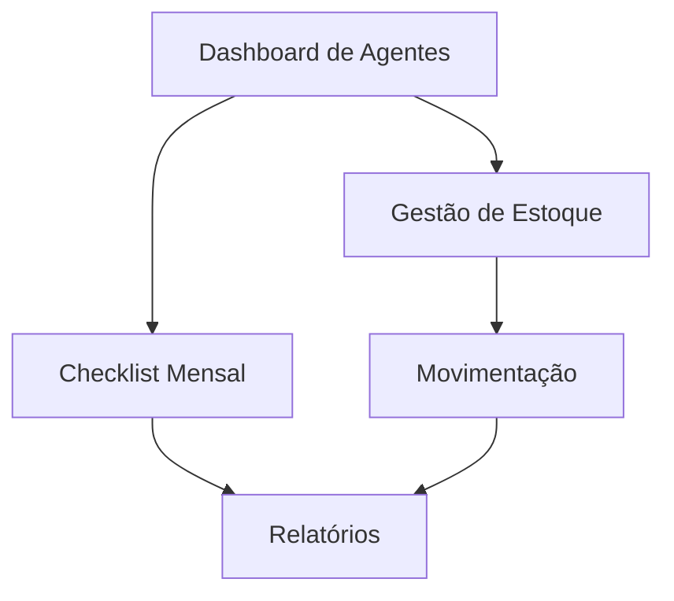

# Sistema de Gestão de Agentes Extintores

## 1. Visão Geral do Produto

Sistema completo de gestão e controle de agentes extintores para bombeiros, focado no gerenciamento de três tipos principais: LGE (Líquido Gerador de Espuma), Pó Químico e Nitrogênio. O sistema permite controle preciso de estoque, rastreamento de validades e geração de relatórios mensais para garantir a operacionalidade dos equipamentos de combate a incêndio.

O produto resolve problemas críticos de controle de estoque e rastreabilidade de agentes extintores, sendo utilizado por bombeiros e gestores de equipamentos para manter a prontidão operacional das viaturas CCI, CRS, CCI RT e CA.

## 2. Funcionalidades Principais

### 2.1 Papéis de Usuário

| Papel | Método de Registro | Permissões Principais |
|-------|-------------------|----------------------|
| Bombeiro Operacional | Autenticação via Supabase | Visualizar estoque, registrar saídas, preencher checklists |
| Gestor de Equipamentos | Autenticação via Supabase | Todas as permissões + adicionar agentes, gerar relatórios |

### 2.2 Módulos de Funcionalidade

Nosso sistema de Agentes Extintores consiste nas seguintes páginas principais:
1. **Dashboard de Agentes**: visão geral do estoque, alertas de validade, estatísticas mensais
2. **Gestão de Estoque**: controle de quantidades por tipo de agente, situação (em linha/estoque)
3. **Checklist Mensal**: formulário de verificação mensal dos agentes
4. **Movimentação**: registro de entradas e saídas de agentes
5. **Relatórios**: geração de relatórios mensais de controle

### 2.3 Detalhes das Páginas

| Nome da Página | Nome do Módulo | Descrição da Funcionalidade |
|----------------|----------------|-----------------------------|
| Dashboard de Agentes | Visão Geral | Exibir estatísticas de estoque por tipo, alertas de validade próxima, gráficos de consumo mensal |
| Gestão de Estoque | Controle de Agentes | Adicionar novos agentes, editar informações, visualizar detalhes por tipo (LGE em litros, Pó Químico em kg, Nitrogênio em cilindros) |
| Checklist Mensal | Verificação Periódica | Formulário para verificação mensal dos agentes, registro de conformidades e não-conformidades |
| Movimentação | Registro de Saídas | Registrar retiradas de agentes para uso em viaturas, controle de consumo por equipe (Alfa, Bravo, Charlie, Delta) |
| Relatórios | Geração de Documentos | Gerar relatórios mensais de controle, exportar dados em PDF, histórico de movimentações |

## 3. Processo Principal

**Fluxo do Gestor de Equipamentos:**
1. Acessa o dashboard para visão geral do estoque
2. Adiciona novos agentes ao sistema com dados obrigatórios
3. Configura alertas de validade por tipo de agente
4. Gera relatórios mensais de controle

**Fluxo do Bombeiro Operacional:**
1. Visualiza estoque disponível por tipo de agente
2. Registra saídas de agentes para uso em viaturas
3. Preenche checklist mensal de verificação
4. Consulta histórico de movimentações

## 4. Design da Interface do Usuário

### 4.1 Estilo de Design

- **Cores primárias**: Azul (#3B82F6) para ações principais, Vermelho (#EF4444) para alertas
- **Cores secundárias**: Verde (#10B981) para status positivo, Amarelo (#F59E0B) para avisos
- **Estilo dos botões**: Arredondados com sombra sutil, hover com transição suave
- **Fonte**: Inter, tamanhos 14px (corpo), 18px (subtítulos), 24px (títulos)
- **Layout**: Design em cards com navegação por abas, sidebar responsiva
- **Ícones**: Lucide React com estilo outline, tamanho 20px padrão

### 4.2 Visão Geral do Design das Páginas

| Nome da Página | Nome do Módulo | Elementos da UI |
|----------------|----------------|----------------|
| Dashboard de Agentes | Visão Geral | Cards de estatísticas, gráficos de rosca para distribuição por tipo, tabela de alertas de validade |
| Gestão de Estoque | Controle de Agentes | Formulário modal para adicionar agentes, tabela com filtros por tipo, badges para situação (em linha/estoque) |
| Checklist Mensal | Verificação Periódica | Formulário em etapas por tipo de agente, checkboxes para itens de verificação, campo de observações |
| Movimentação | Registro de Saídas | Formulário de saída com seleção de agente e quantidade, histórico em tabela com paginação |
| Relatórios | Geração de Documentos | Filtros de período, botões de exportação PDF, preview do relatório |

### 4.3 Responsividade

O produto é desktop-first com adaptação mobile, incluindo otimização para touch em tablets e smartphones para uso em campo pelos bombeiros.