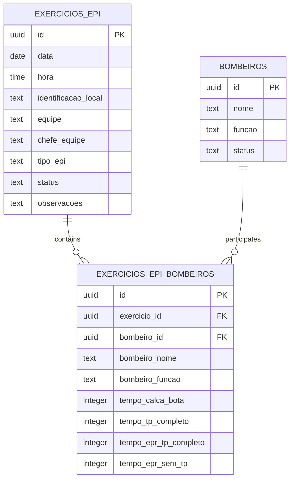
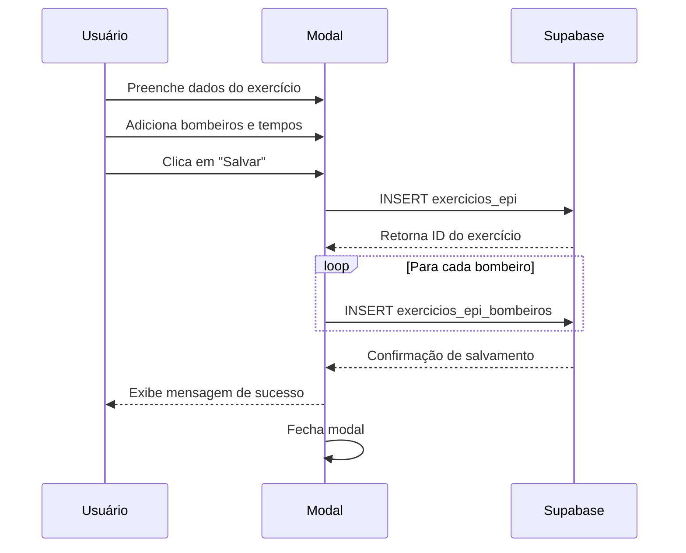
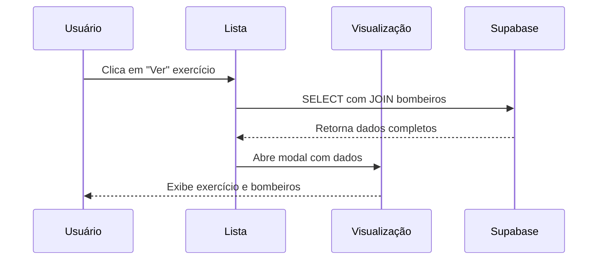

# Documentação Técnica - Reestruturação Sistema de Exercícios EPI/EPR

## 1. Visão Geral do Projeto

O sistema atual de exercícios EPI/EPR armazena dados de forma agregada, onde todos os bombeiros de um exercício são salvos como um array na tabela principal. Esta reestruturação visa implementar armazenamento individual por bombeiro, permitindo melhor rastreabilidade, consultas mais precisas e integridade de dados.

## 2. Estrutura Atual vs Nova Estrutura

### 2.1 Estrutura Atual
- **Tabela única**: `exercicios_epi`
- **Dados dos bombeiros**: Armazenados como array de strings no campo `bombeiros`
- **Tempos individuais**: Não armazenados individualmente
- **Limitações**: Dificuldade para consultas por bombeiro específico, impossibilidade de rastrear tempos individuais

### 2.2 Nova Estrutura Proposta
- **Tabela principal**: `exercicios_epi` (dados gerais do exercício)
- **Tabela de detalhes**: `exercicios_epi_bombeiros` (dados individuais por bombeiro)
- **Relacionamento**: Foreign Key entre as tabelas
- **Benefícios**: Consultas precisas, integridade referencial, rastreabilidade individual

## 3. Estrutura das Tabelas

### 3.1 Tabela Principal - exercicios_epi (Modificada)

```sql
CREATE TABLE IF NOT EXISTS exercicios_epi (
  id UUID DEFAULT gen_random_uuid() PRIMARY KEY,
  data DATE NOT NULL,
  hora TIME,
  identificacao_local TEXT,
  equipe TEXT NOT NULL CHECK (equipe IN ('Alfa', 'Bravo', 'Charlie', 'Delta')),
  chefe_equipe TEXT NOT NULL,
  tipo_epi TEXT NOT NULL CHECK (tipo_epi IN ('EPI', 'EPR')),
  status TEXT NOT NULL DEFAULT 'Pendente' CHECK (status IN ('Pendente', 'Em Andamento', 'Concluído', 'Cancelado')),
  observacoes TEXT,
  created_at TIMESTAMP WITH TIME ZONE DEFAULT NOW(),
  updated_at TIMESTAMP WITH TIME ZONE DEFAULT NOW()
);
```

**Modificações realizadas:**
- Removido campo `bombeiros` (array)
- Removido campo `tempo_vestimento` (será individual)
- Adicionado campo `hora`
- Adicionado campo `identificacao_local`

### 3.2 Nova Tabela - exercicios_epi_bombeiros

```sql
CREATE TABLE IF NOT EXISTS exercicios_epi_bombeiros (
  id UUID DEFAULT gen_random_uuid() PRIMARY KEY,
  exercicio_id UUID NOT NULL REFERENCES exercicios_epi(id) ON DELETE CASCADE,
  bombeiro_id UUID REFERENCES bombeiros(id),
  bombeiro_nome TEXT NOT NULL,
  bombeiro_funcao TEXT NOT NULL,
  tempo_calca_bota INTEGER, -- tempo em segundos
  tempo_tp_completo INTEGER, -- tempo em segundos
  tempo_epr_tp_completo INTEGER, -- tempo em segundos
  tempo_epr_sem_tp INTEGER, -- tempo em segundos
  created_at TIMESTAMP WITH TIME ZONE DEFAULT NOW(),
  updated_at TIMESTAMP WITH TIME ZONE DEFAULT NOW()
);
```

**Campos explicados:**
- `exercicio_id`: Chave estrangeira para `exercicios_epi`
- `bombeiro_id`: Referência ao bombeiro cadastrado (pode ser NULL para bombeiros não cadastrados)
- `bombeiro_nome`: Nome do bombeiro (sempre preenchido)
- `bombeiro_funcao`: Função do bombeiro no exercício
- `tempo_*`: Tempos individuais em segundos para cada categoria

## 4. Relacionamentos e Índices

### 4.1 Relacionamentos



### 4.2 Índices para Performance

```sql
-- Índices na tabela principal
CREATE INDEX idx_exercicios_epi_data ON exercicios_epi(data);
CREATE INDEX idx_exercicios_epi_equipe ON exercicios_epi(equipe);
CREATE INDEX idx_exercicios_epi_status ON exercicios_epi(status);
CREATE INDEX idx_exercicios_epi_tipo_epi ON exercicios_epi(tipo_epi);

-- Índices na tabela de bombeiros
CREATE INDEX idx_exercicios_epi_bombeiros_exercicio_id ON exercicios_epi_bombeiros(exercicio_id);
CREATE INDEX idx_exercicios_epi_bombeiros_bombeiro_id ON exercicios_epi_bombeiros(bombeiro_id);
CREATE INDEX idx_exercicios_epi_bombeiros_nome ON exercicios_epi_bombeiros(bombeiro_nome);
```

## 5. Políticas de Segurança (RLS)

### 5.1 Tabela exercicios_epi_bombeiros

```sql
-- Habilitar RLS
ALTER TABLE exercicios_epi_bombeiros ENABLE ROW LEVEL SECURITY;

-- Políticas de acesso
CREATE POLICY "Permitir leitura para usuários autenticados" ON exercicios_epi_bombeiros
  FOR SELECT USING (auth.role() = 'authenticated');

CREATE POLICY "Permitir inserção para usuários autenticados" ON exercicios_epi_bombeiros
  FOR INSERT WITH CHECK (auth.role() = 'authenticated');

CREATE POLICY "Permitir atualização para usuários autenticados" ON exercicios_epi_bombeiros
  FOR UPDATE USING (auth.role() = 'authenticated');

CREATE POLICY "Permitir exclusão para usuários autenticados" ON exercicios_epi_bombeiros
  FOR DELETE USING (auth.role() = 'authenticated');

-- Conceder permissões
GRANT ALL PRIVILEGES ON exercicios_epi_bombeiros TO authenticated;
GRANT SELECT ON exercicios_epi_bombeiros TO anon;
```

## 6. Modificações no Frontend

### 6.1 Interfaces TypeScript

```typescript
// Atualizar interface principal
export interface ExercicioEPI {
  id: string;
  data: string;
  hora?: string;
  identificacao_local?: string;
  equipe: 'Alfa' | 'Bravo' | 'Charlie' | 'Delta';
  chefe_equipe: string;
  tipo_epi: 'EPI' | 'EPR';
  status: 'Pendente' | 'Em Andamento' | 'Concluído' | 'Cancelado';
  observacoes?: string;
  created_at: string;
  updated_at: string;
  // Relacionamento
  bombeiros?: ExercicioEPIBombeiro[];
}

// Nova interface para bombeiros individuais
export interface ExercicioEPIBombeiro {
  id: string;
  exercicio_id: string;
  bombeiro_id?: string;
  bombeiro_nome: string;
  bombeiro_funcao: string;
  tempo_calca_bota?: number;
  tempo_tp_completo?: number;
  tempo_epr_tp_completo?: number;
  tempo_epr_sem_tp?: number;
  created_at: string;
  updated_at: string;
}
```

### 6.2 Modificações no Modal (ExercicioEPIModal.tsx)

**Função de salvamento atualizada:**

```typescript
const handleSave = async () => {
  setLoading(true);
  
  try {
    // 1. Salvar dados principais do exercício
    const exercicioData = {
      data,
      hora,
      identificacao_local: identificacaoLocal,
      equipe,
      chefe_equipe: chefeEquipe,
      tipo_epi: "EPI", // ou "EPR" baseado na seleção
      status: "Concluído",
      observacoes
    };

    let exercicioId;
    
    if (exercicioParaEdicao) {
      // Atualizar exercício existente
      const { error } = await supabase
        .from('exercicios_epi')
        .update(exercicioData)
        .eq('id', exercicioParaEdicao.id);
      
      if (error) throw error;
      exercicioId = exercicioParaEdicao.id;
      
      // Remover bombeiros existentes
      await supabase
        .from('exercicios_epi_bombeiros')
        .delete()
        .eq('exercicio_id', exercicioId);
    } else {
      // Criar novo exercício
      const { data: novoExercicio, error } = await supabase
        .from('exercicios_epi')
        .insert(exercicioData)
        .select()
        .single();
      
      if (error) throw error;
      exercicioId = novoExercicio.id;
    }

    // 2. Salvar dados individuais dos bombeiros
    const bombeirosData = bombeiros.map(bombeiro => ({
      exercicio_id: exercicioId,
      bombeiro_id: bombeirosCadastrados.find(b => b.nome === bombeiro.nome)?.id || null,
      bombeiro_nome: bombeiro.nome,
      bombeiro_funcao: bombeiro.funcao,
      tempo_calca_bota: timeToSeconds(bombeiro.calcaBota),
      tempo_tp_completo: timeToSeconds(bombeiro.tpCompleto),
      tempo_epr_tp_completo: timeToSeconds(bombeiro.eprTpCompleto),
      tempo_epr_sem_tp: timeToSeconds(bombeiro.eprSemTp)
    }));

    const { error: bombeirosError } = await supabase
      .from('exercicios_epi_bombeiros')
      .insert(bombeirosData);

    if (bombeirosError) throw bombeirosError;

    toast({
      title: exercicioParaEdicao ? "Exercício atualizado" : "Exercício criado",
      description: "Dados salvos com sucesso.",
    });
    
    onOpenChange(false);
  } catch (error) {
    console.error('Erro ao salvar exercício:', error);
    toast({
      title: "Erro",
      description: "Erro ao salvar exercício.",
      variant: "destructive",
    });
  } finally {
    setLoading(false);
  }
};

// Função auxiliar para converter tempo MM:SS para segundos
const timeToSeconds = (timeString: string): number => {
  if (!timeString) return 0;
  const [minutes, seconds] = timeString.split(':').map(Number);
  return (minutes || 0) * 60 + (seconds || 0);
};
```

### 6.3 Hooks de Consulta Atualizados

```typescript
// Hook para buscar exercícios com bombeiros
export const useExerciciosEPI = () => {
  return useQuery({
    queryKey: ['exercicios-epi'],
    queryFn: async () => {
      const { data, error } = await supabase
        .from('exercicios_epi')
        .select(`
          *,
          bombeiros:exercicios_epi_bombeiros(*)
        `)
        .order('data', { ascending: false });
      
      if (error) throw error;
      return data;
    }
  });
};
```

## 7. Componente de Visualização Atualizado

### 7.1 ExercicioEPIVisualizacao.tsx

```typescript
// Atualizar para usar nova estrutura de dados
const ExercicioEPIVisualizacao = ({ exercicio, open, onOpenChange }) => {
  if (!exercicio) return null;

  return (
    <Dialog open={open} onOpenChange={onOpenChange}>
      <DialogContent className="max-w-4xl max-h-[90vh] overflow-y-auto">
        {/* Cabeçalho com dados gerais */}
        <div className="mb-4">
          <h2>Exercício de {exercicio.tipo_epi}</h2>
          <p>Data: {exercicio.data} - Hora: {exercicio.hora}</p>
          <p>Local: {exercicio.identificacao_local}</p>
          <p>Equipe: {exercicio.equipe}</p>
          <p>Chefe: {exercicio.chefe_equipe}</p>
        </div>

        {/* Tabela de bombeiros com tempos individuais */}
        <div className="overflow-x-auto">
          <table className="w-full border-collapse border">
            <thead>
              <tr>
                <th>Nome</th>
                <th>Função</th>
                <th>Calça + Bota</th>
                <th>TP Completo</th>
                <th>EPR + TP Completo</th>
                <th>EPR sem TP</th>
              </tr>
            </thead>
            <tbody>
              {exercicio.bombeiros?.map((bombeiro) => (
                <tr key={bombeiro.id}>
                  <td>{bombeiro.bombeiro_nome}</td>
                  <td>{bombeiro.bombeiro_funcao}</td>
                  <td>{secondsToTime(bombeiro.tempo_calca_bota)}</td>
                  <td>{secondsToTime(bombeiro.tempo_tp_completo)}</td>
                  <td>{secondsToTime(bombeiro.tempo_epr_tp_completo)}</td>
                  <td>{secondsToTime(bombeiro.tempo_epr_sem_tp)}</td>
                </tr>
              ))}
            </tbody>
          </table>
        </div>

        {/* Observações */}
        {exercicio.observacoes && (
          <div className="mt-4">
            <h3>Observações:</h3>
            <p>{exercicio.observacoes}</p>
          </div>
        )}
      </DialogContent>
    </Dialog>
  );
};

// Função auxiliar para converter segundos para MM:SS
const secondsToTime = (seconds: number): string => {
  if (!seconds) return "00:00";
  const mins = Math.floor(seconds / 60);
  const secs = seconds % 60;
  return `${mins.toString().padStart(2, '0')}:${secs.toString().padStart(2, '0')}`;
};
```

## 8. Migração de Dados

### 8.1 Script de Migração

```sql
-- Script para migrar dados existentes
-- ATENÇÃO: Executar em ambiente de desenvolvimento primeiro

-- 1. Criar nova tabela
CREATE TABLE IF NOT EXISTS exercicios_epi_bombeiros (
  id UUID DEFAULT gen_random_uuid() PRIMARY KEY,
  exercicio_id UUID NOT NULL REFERENCES exercicios_epi(id) ON DELETE CASCADE,
  bombeiro_id UUID REFERENCES bombeiros(id),
  bombeiro_nome TEXT NOT NULL,
  bombeiro_funcao TEXT NOT NULL,
  tempo_calca_bota INTEGER,
  tempo_tp_completo INTEGER,
  tempo_epr_tp_completo INTEGER,
  tempo_epr_sem_tp INTEGER,
  created_at TIMESTAMP WITH TIME ZONE DEFAULT NOW(),
  updated_at TIMESTAMP WITH TIME ZONE DEFAULT NOW()
);

-- 2. Migrar dados existentes (exemplo básico)
-- Nota: Este script assume que os dados atuais no campo 'bombeiros' 
-- são apenas nomes. Ajustar conforme estrutura real.

INSERT INTO exercicios_epi_bombeiros (exercicio_id, bombeiro_nome, bombeiro_funcao)
SELECT 
  e.id,
  unnest(e.bombeiros) as bombeiro_nome,
  'Função não especificada' as bombeiro_funcao
FROM exercicios_epi e
WHERE array_length(e.bombeiros, 1) > 0;

-- 3. Adicionar novos campos à tabela principal
ALTER TABLE exercicios_epi ADD COLUMN IF NOT EXISTS hora TIME;
ALTER TABLE exercicios_epi ADD COLUMN IF NOT EXISTS identificacao_local TEXT;

-- 4. Remover campo bombeiros após confirmação da migração
-- ALTER TABLE exercicios_epi DROP COLUMN bombeiros;
-- ALTER TABLE exercicios_epi DROP COLUMN tempo_vestimento;
```

## 9. Fluxo de Dados

### 9.1 Fluxo de Criação de Exercício



### 9.2 Fluxo de Visualização



## 10. Benefícios da Reestruturação

### 10.1 Melhorias Técnicas
- **Normalização**: Dados organizados seguindo boas práticas de banco de dados
- **Integridade Referencial**: Foreign keys garantem consistência
- **Performance**: Índices otimizados para consultas frequentes
- **Escalabilidade**: Estrutura preparada para crescimento

### 10.2 Melhorias Funcionais
- **Rastreabilidade Individual**: Cada bombeiro tem registro próprio
- **Consultas Precisas**: Busca por bombeiro específico
- **Relatórios Detalhados**: Análise de performance individual
- **Histórico Completo**: Acompanhamento de evolução por pessoa

### 10.3 Melhorias de UX
- **Visualização Organizada**: Dados apresentados de forma clara
- **Edição Granular**: Modificação de dados específicos
- **Validação Aprimorada**: Controle de integridade em tempo real
- **Performance**: Carregamento mais rápido com dados estruturados

## 11. Considerações de Implementação

### 11.1 Ordem de Implementação
1. Criar nova tabela `exercicios_epi_bombeiros`
2. Atualizar interfaces TypeScript
3. Modificar modal de criação/edição
4. Atualizar componente de visualização
5. Atualizar hooks de consulta
6. Migrar dados existentes
7. Remover campos obsoletos

### 11.2 Testes Necessários
- Criação de exercício com múltiplos bombeiros
- Edição de exercício existente
- Visualização de dados migrados
- Performance de consultas com JOIN
- Integridade referencial em exclusões

### 11.3 Rollback Plan
- Manter campos antigos durante período de transição
- Script de reversão de migração
- Backup completo antes da implementação
- Monitoramento de performance pós-implementação

Esta reestruturação transformará o sistema de exercícios EPI/EPR em uma solução mais robusta, escalável e funcional, proporcionando melhor experiência para usuários e administradores.